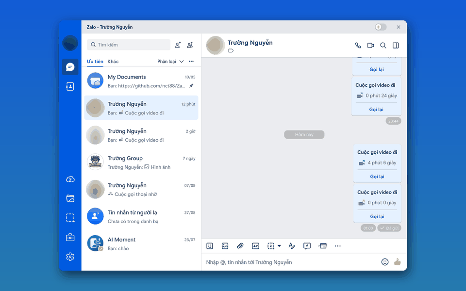
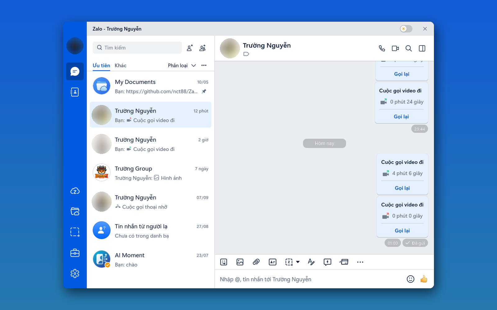
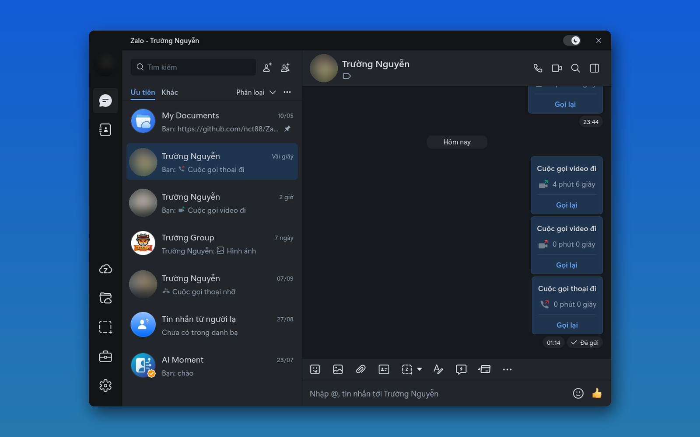
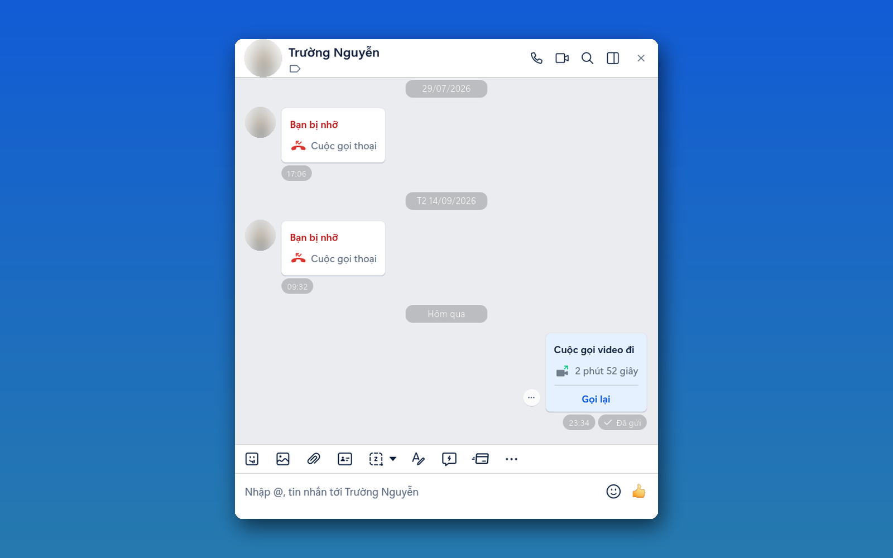
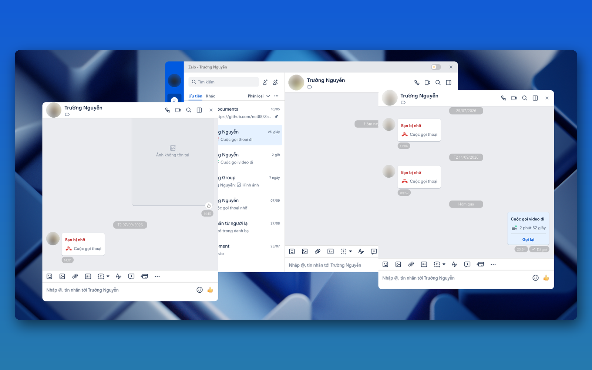
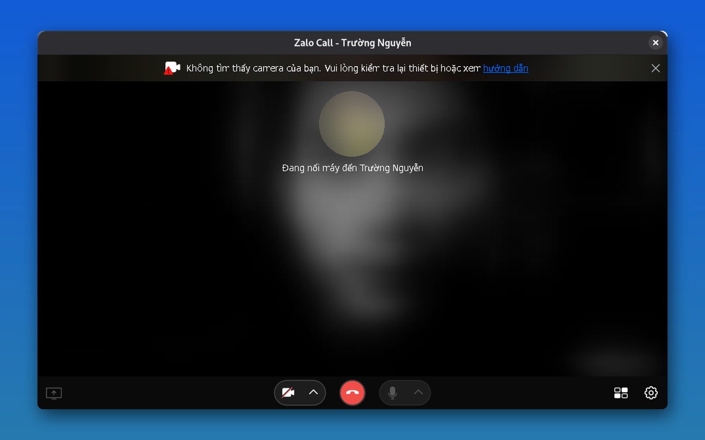
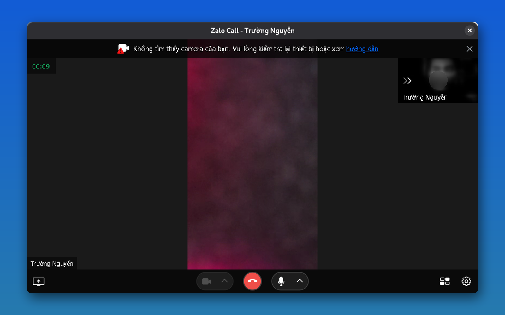
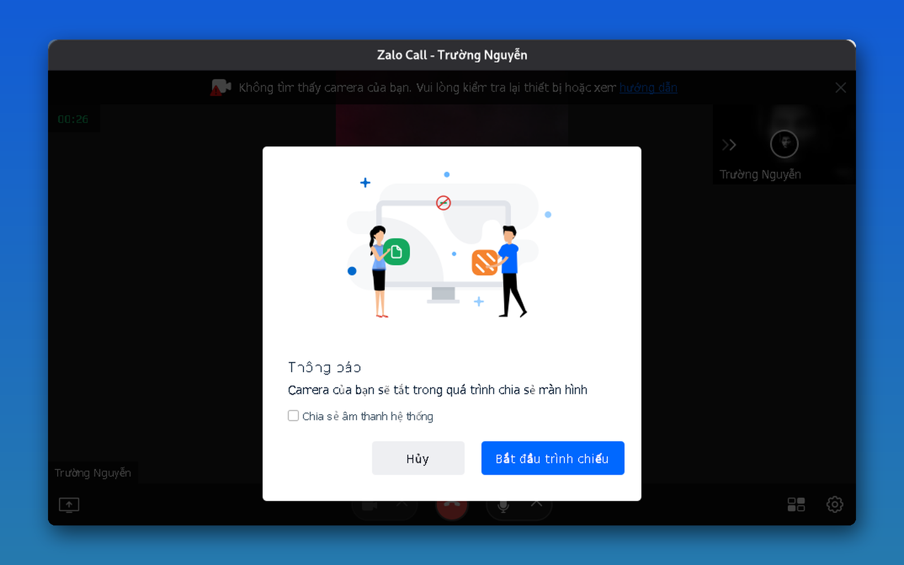
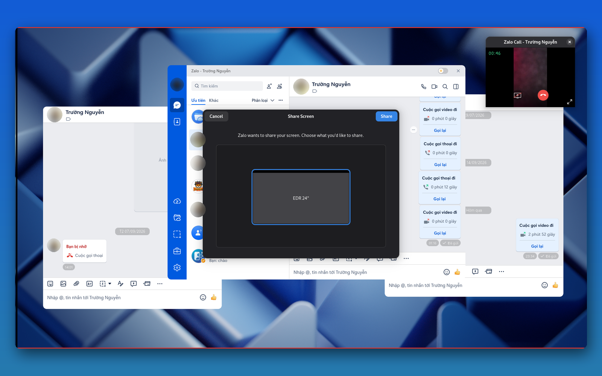

<div align="center">

# Zalo for Linux 🐧

**Zalo PC chạy trên Linux — nhắn tin, gọi thoại, gọi video và chia sẻ màn hình, đóng gói trong một file AppImage.**

*The Zalo desktop client for Linux — messaging, voice/video calls and screen sharing in a single AppImage.*

[](https://github.com/VN-Linux-Family/zalo-for-linux/actions/workflows/build.yml)
[](https://github.com/VN-Linux-Family/zalo-for-linux/releases)
[](./LICENSE)


[Tải về](#-cài-đặt) · [Tính năng](#-tính-năng) · [Gọi video & chia sẻ màn hình](#-gọi-điện-video-và-chia-sẻ-màn-hình) · [Build từ nguồn](#-build-từ-mã-nguồn) · [Lỗi thường gặp](#-lỗi-thường-gặp) · [English](#-english-summary)

</div>

---

> [!IMPORTANT]
> Đây là dự án **không chính thức** do cộng đồng phát triển. Zalo là thương hiệu của
> VNG Corporation; dự án không liên kết và không được VNG bảo trợ. Mã nguồn của Zalo
> **không** nằm trong repo này — mỗi lần build, script tải bản Zalo chính thức rồi vá
> lại để chạy trên Linux.

<div align="center">
  
  <br/>
  <sub>Chạy trên Debian 13 · GNOME Wayland. Ảnh đại diện đã được làm mờ.</sub>
</div>

## 📑 Mục lục

- [Giới thiệu](#-giới-thiệu)
- [Ảnh chụp giao diện](#%EF%B8%8F-ảnh-chụp-giao-diện)
- [Tính năng](#-tính-năng)
- [Cài đặt](#-cài-đặt)
- [Gọi điện, video và chia sẻ màn hình](#-gọi-điện-video-và-chia-sẻ-màn-hình)
- [Tuỳ chọn khi chạy và biến môi trường](#%EF%B8%8F-tuỳ-chọn-khi-chạy-và-biến-môi-trường)
- [Build từ mã nguồn](#-build-từ-mã-nguồn)
- [Cách hoạt động](#%EF%B8%8F-cách-hoạt-động)
- [Lỗi thường gặp](#-lỗi-thường-gặp)
- [Đóng góp](#-đóng-góp)
- [Ghi công](#-ghi-công)
- [Giấy phép](#-giấy-phép)
- [English summary](#-english-summary)

## 👋 Giới thiệu

VNG không phát hành Zalo PC cho Linux. Dự án này lấy **bản Zalo chính thức cho macOS**
(một ứng dụng Electron), tách phần giao diện JavaScript ra, thay các thư viện native
chỉ có trên macOS bằng bản viết lại cho Linux, vá những chỗ phụ thuộc hệ điều hành,
rồi đóng gói lại thành **AppImage** chạy được trên hầu hết các distro.

Riêng phần gọi điện, Zalo dùng một chương trình riêng là `ZaloCall.exe`. Dự án chạy
bản Windows của chương trình này qua **Wine** và bắc cầu kênh giao tiếp về app Linux
(xem [zcall-bridge](./zcall-bridge/README.md)). Trên Wayland, một cầu nối riêng đưa
hình màn hình thật vào cuộc gọi để chia sẻ màn hình hoạt động.

Cảm ơn **[@realdtn2](https://github.com/realdtn2)** với giải pháp gốc
[realdtn2/zalo-linux-2026](https://github.com/realdtn2/zalo-linux-2026).

## 🖼️ Ảnh chụp giao diện

> Tất cả ảnh chụp từ bản AppImage thật trên Debian 13 (GNOME, Wayland), cùng khung 1600×1000.

### Giao diện sáng / tối — một nút gạt trên thanh tiêu đề

<div align="center">
  
</div>

<table>
  <tr>
    <td width="50%"></td>
    <td width="50%"></td>
  </tr>
  <tr>
    <td align="center"><b>Giao diện sáng</b><br/><sub>Thanh tiêu đề riêng, bo góc, nút gạt ☀️/🌙 và nút đóng</sub></td>
    <td align="center"><b>Giao diện tối</b><br/><sub>Bấm nút gạt để đổi · chuột phải để theo lại hệ thống</sub></td>
  </tr>
</table>

### Nhiều cửa sổ chat

<table>
  <tr>
    <td width="50%"></td>
    <td width="50%"></td>
  </tr>
  <tr>
    <td align="center"><b>Mở cửa sổ riêng</b><br/><sub>Mỗi cuộc trò chuyện một cửa sổ, có nút đóng và kéo thả</sub></td>
    <td align="center"><b>Nhiều cửa sổ cùng lúc</b><br/><sub>Cửa sổ chính vẫn mượt, không bị treo</sub></td>
  </tr>
</table>

### Gọi video và chia sẻ màn hình

<table>
  <tr>
    <td width="50%"></td>
    <td width="50%"></td>
  </tr>
  <tr>
    <td align="center"><b>① Đang nối máy</b><br/><sub>Cửa sổ Zalo Call tự nổi lên trên cửa sổ chính</sub></td>
    <td align="center"><b>② Đang gọi video</b><br/><sub>Đếm giờ, bật/tắt mic, camera, chia sẻ màn hình</sub></td>
  </tr>
  <tr>
    <td width="50%"></td>
    <td width="50%"></td>
  </tr>
  <tr>
    <td align="center"><b>③ Bắt đầu trình chiếu</b><br/><sub>Hộp thoại của Zalo, tuỳ chọn chia sẻ cả âm thanh</sub></td>
    <td align="center"><b>④ Chọn màn hình</b><br/><sub>Hộp thoại chuẩn của hệ thống (XDG portal) trên Wayland</sub></td>
  </tr>
</table>

## ✨ Tính năng

### Nhắn tin và dữ liệu

| Tính năng | Trạng thái | Ghi chú |
|---|:---:|---|
| Đăng nhập, nhắn tin, nhóm, danh bạ | ✅ | Giao diện Zalo PC gốc |
| Đồng bộ tin nhắn mã hoá đầu cuối (E2EE) | ✅ | `db-cross-v4` viết lại bằng C++, không cần Wine |
| Bảng thông tin hội thoại (ảnh/video, file, link) | ✅ | Nhờ `db-cross-v4` |
| Thả cảm xúc (reaction) | ✅ | |
| Dán ảnh bằng `Ctrl+V` | ✅ | Wayland qua `wl-clipboard`, X11 qua `xclip` |
| Gửi ảnh dạng ảnh (không thành file đính kèm) | ✅ | Vá luồng resize ảnh `zimage` |
| Ảnh JPEG XL, thumbnail video MP4 | ✅ | `zjxl`, `mp4thumb` viết lại bằng Rust |
| Lưu file nhận về theo thư mục XDG | ✅ | Dùng `$XDG_DOWNLOAD_DIR` thay vì `~/Zalo Received Files` |
| Mở link / mở file bằng ứng dụng mặc định | ✅ | `xdg-open` |

### Gọi điện

| Tính năng | x86_64 | aarch64 | Ghi chú |
|---|:---:|:---:|---|
| Gọi thoại 1–1 | ✅ | ❌ | `ZaloCall.exe` chạy qua Wine |
| Gọi video 1–1 | ✅ | ❌ | Cần GStreamer + libv4l 32-bit |
| Chia sẻ màn hình trên X11 | ✅ | ❌ | Hoạt động trực tiếp |
| Chia sẻ màn hình trên Wayland | ✅ | ❌ | Qua cầu nối XDG ScreenCast → Xvfb |
| Tự tải Wine khi cần | ✅ | — | ~54 MB, lưu trong thư mục dữ liệu app |
| Bản **Full** có sẵn Wine | ✅ | — | Gọi được ngay lần mở đầu, không cần mạng |
| Cửa sổ gọi tự nổi lên trên (GNOME) | ✅ | — | `zcall-raise` sửa lỗi cửa sổ gọi mở bị thu nhỏ hoặc nằm sau Zalo, và kẹt lại sau khi tắt máy |
| Dọn tiến trình gọi còn sót | ✅ | — | Tự dọn `pipebridge.exe`/`ZaloCall.exe` của lần thoát lỗi trước, cổng 29631/29632 chỉ nghe trên `127.0.0.1` |

> Gọi điện chưa hỗ trợ ARM64 vì `ZaloCall.exe` chỉ có bản x86.

### Tích hợp desktop Linux

| Tính năng | Ghi chú |
|---|---|
| Biểu tượng khay hệ thống | Mở/Ẩn Zalo, Toggle DevTools, **Cài đặt gọi điện…**, Thoát |
| Đóng cửa sổ thì thu xuống khay | App vẫn chạy nền để nhận tin |
| Khởi động cùng hệ thống | Ghi `~/.config/autostart/zalo.desktop` |
| Khởi động ẩn trong khay | Tự bật khi dùng autostart, hoặc chạy với `--hidden` |
| Đếm tin chưa đọc trên dock/taskbar | Giao thức badge của Unity/KDE/GNOME |
| Tự theo chế độ sáng/tối của hệ thống | GNOME D-Bus, XDG Desktop Portal hoặc gtk-theme |
| Chụp màn hình trong app | Dùng công cụ có sẵn trên máy, tự dán ảnh vào khung chat |
| Thanh tiêu đề riêng, bo góc 10px | Không còn menu Electron (Zalo/File/View/Window) và khoảng trống thừa |
| Nút gạt sáng/tối trên thanh tiêu đề | Bấm để ghim giao diện kia, chuột phải để theo lại hệ thống. Ghi nhớ sau khi mở lại app |
| Nút đóng | Thu xuống khay; thoát hẳn nếu desktop không có khay hệ thống (GNOME mặc định) |
| Mở chat ở cửa sổ riêng | Nhiều cửa sổ cùng lúc, mỗi cửa sổ có nút đóng, kéo thả, bo góc |
| Tự cập nhật | App báo khi có bản mới, cập nhật ngay trong app (zsync) |

### Mở rộng

| Tính năng | Ghi chú |
|---|---|
| 🌙 **ZaDark** tích hợp sẵn | Giao diện tối cho Zalo, đổi font, hình nền chat, dịch tin nhắn, 80+ emoji, chống nhìn trộm, ẩn trạng thái "đang soạn tin" / "đã nhận" / "đã xem". Có bản build không kèm ZaDark |
| 🧩 **Quản lý userscript** | Tạo, dán, sửa, nhập, bật/tắt script kiểu Tampermonkey ngay trong app |

<details>
<summary><b>Chi tiết: ZaDark</b></summary>

[ZaDark](https://github.com/quaric/zadark) của [Quaric](https://zadark.com) (giấy phép
MPL-2.0) được tích hợp trong lúc build:

- Dark mode làm riêng cho Zalo
- Tuỳ chỉnh font chữ và cỡ chữ
- Đặt hình nền riêng cho từng cuộc trò chuyện
- Dịch nhanh tin nhắn
- Thả cảm xúc với hơn 80 emoji
- Chống nhìn trộm tin nhắn
- Ẩn trạng thái "đang soạn tin", "đã nhận", "đã xem"

</details>

<details>
<summary><b>Chi tiết: Quản lý userscript</b></summary>

Mở **Cài đặt → Userscripts manager**. App nhận các khai báo metadata kiểu Tampermonkey
(`@name`, `@description`, `@version`, `@match`, `@include`, `@exclude`), nhập được file
`.js` và `.user.js`.

Lớp tương thích hiện có: `GM_info`, `GM_addStyle`, `GM_getValue`, `GM_setValue`,
`GM_deleteValue`, `GM_listValues`, `unsafeWindow`. Thay đổi có hiệu lực ở lần tải trang
Zalo tiếp theo.

> [!WARNING]
> Userscript chạy với quyền truy cập trang Zalo và các tin nhắn đang hiển thị. Chỉ cài
> script mà bạn tin tưởng mã nguồn.

</details>

<details>
<summary><b>Chi tiết: Công cụ chụp màn hình được hỗ trợ</b></summary>

App tự dùng công cụ đầu tiên tìm thấy: `cosmic-screenshot`, `deepin-screen-recorder`,
`spectacle`, `flameshot`, `gnome-screenshot`, `xfce4-screenshooter`, `mate-screenshot`,
`ksnapshot`, `scrot`. Ảnh chụp xong được dán thẳng vào khung chat đang mở.

</details>

## 📦 Cài đặt

### 1. Chọn bản phù hợp

Tải từ trang [**Releases**](https://github.com/VN-Linux-Family/zalo-for-linux/releases):

| File | ZaDark | Wine đi kèm | Dung lượng | Dành cho |
|---|:---:|:---:|---|---|
| `Zalo-<ver>+ZaDark-<zdv>-…-x86_64.AppImage` | ✅ | — | ~263 MB | Hầu hết mọi người |
| `Zalo-<ver>-…-x86_64.AppImage` | — | — | ~263 MB | Muốn giao diện Zalo gốc |
| `…-Full-x86_64.AppImage` | ✅ | ✅ | ~430 MB | Gọi điện ngay, không phải tải Wine |
| `…-PlainFull-x86_64.AppImage` | — | ✅ | ~430 MB | Như trên, không ZaDark |
| `…-aarch64.AppImage` | tuỳ bản | — | | Máy ARM64 (chưa gọi điện được) |

> [!NOTE]
> **Không** tải các file `.AppImage.zsync` — chúng chỉ dùng cho cập nhật từng phần.

### 2. Cài bằng Gear Lever (khuyên dùng)

[Gear Lever](https://flathub.org/apps/it.mijorus.gearlever) đưa AppImage vào menu ứng dụng
và quản lý cập nhật.

```bash
flatpak install flathub it.mijorus.gearlever
```

1. Mở Gear Lever, bấm **Open** ở góc trên bên trái, chọn file `.AppImage` vừa tải.
2. Bấm **Unlock**, rồi chọn **Move to the app menu**.
3. Mở Zalo từ menu ứng dụng như mọi app khác.

### 3. Hoặc chạy trực tiếp

```bash
chmod +x Zalo-*.AppImage
./Zalo-*.AppImage
```

### 4. Thư viện theo từng distro

Nhắn tin chỉ cần AppImage. Gọi điện dùng Wine bản 32-bit nên máy cần thêm **thư viện
32-bit**. Nếu thiếu, app sẽ hiện hộp thoại kèm đúng lệnh cho distro của bạn. Bạn cũng có
thể cài trước:

<details open>
<summary><b>Ubuntu / Debian / Linux Mint / Pop!_OS</b></summary>

```bash
sudo dpkg --add-architecture i386 && sudo apt update

# Gọi thoại (loa + mic)
sudo apt install -y libc6:i386 libx11-6:i386 libxext6:i386 libfreetype6:i386 \
  libgl1:i386 libpulse0:i386 libasound2:i386 zlib1g:i386

# Gọi video
sudo apt install -y libgstreamer1.0-0:i386 libgstreamer-plugins-base1.0-0:i386 \
  gstreamer1.0-plugins-good:i386 libv4l-0:i386 gstreamer1.0-libav:i386

# Chia sẻ màn hình trên Wayland
sudo apt install -y xvfb xdotool python3-dbus \
  gstreamer1.0-plugins-base gstreamer1.0-plugins-bad

# Dán ảnh bằng Ctrl+V
sudo apt install -y wl-clipboard xclip
```

</details>

<details>
<summary><b>Fedora / RHEL</b></summary>

```bash
# Gọi thoại
sudo dnf install -y glibc.i686 libX11.i686 libXext.i686 freetype.i686 \
  mesa-libGL.i686 pulseaudio-libs.i686 alsa-lib.i686 zlib-ng-compat.i686

# Gọi video
sudo dnf install -y gstreamer1.i686 gstreamer1-plugins-base.i686 \
  gstreamer1-plugins-good.i686 libv4l.i686

# Giải mã H.264 (cần RPM Fusion)
sudo dnf install -y https://download1.rpmfusion.org/free/fedora/rpmfusion-free-release-$(rpm -E %fedora).noarch.rpm
sudo dnf install -y gstreamer1-plugin-libav.i686

# Chia sẻ màn hình trên Wayland
sudo dnf install -y xorg-x11-server-Xvfb xdotool python3-dbus \
  gstreamer1-plugins-base gstreamer1-plugins-bad-free

# Dán ảnh bằng Ctrl+V
sudo dnf install -y wl-clipboard xclip
```

</details>

<details>
<summary><b>Arch / Manjaro / EndeavourOS</b></summary>

> Cần bật kho `[multilib]` trong `/etc/pacman.conf`.

```bash
# Gọi thoại
sudo pacman -S --needed lib32-glibc lib32-libx11 lib32-libxext \
  lib32-freetype2 lib32-mesa lib32-libpulse lib32-alsa-lib lib32-zlib

# Gọi video
sudo pacman -S --needed lib32-gstreamer lib32-gst-plugins-base \
  lib32-gst-plugins-good lib32-libv4l lib32-gst-libav

# Chia sẻ màn hình trên Wayland
sudo pacman -S --needed xorg-server-xvfb xdotool python-dbus \
  gst-plugins-base gst-plugins-bad

# Dán ảnh bằng Ctrl+V
sudo pacman -S --needed wl-clipboard xclip
```

</details>

> [!TIP]
> **Đường tắt:** cài Wine của distro (`sudo apt install wine` / `sudo dnf install wine` /
> `sudo pacman -S wine`) — trình quản lý gói sẽ tự kéo đủ thư viện 32-bit, và app tự nhận
> Wine hệ thống.

## 📞 Gọi điện, video và chia sẻ màn hình

### Lần đầu gọi điện

1. Mở app. App tự kiểm tra có Wine chạy được chương trình 32-bit hay không.
   - Có Wine dùng được (hoặc bạn dùng bản **Full**): không hỏi gì cả.
   - Chưa có: hiện hộp thoại **"Tải và bật ngay"** / **"Để sau"**, kèm nguồn tải.
2. Chọn tải → app tải Wine (~54 MB), giải nén và tạo prefix (mất khoảng 1–2 phút).
3. Khi thấy *"Tính năng gọi điện đã sẵn sàng!"* là gọi được ngay, không cần khởi động
   lại, không cần quyền quản trị.

Wine tải về nằm trong `~/.config/ZaloData/zcall-wine-runtime/` và prefix nằm trong
`~/.config/ZaloData/zcall-wine/`. App không động vào `~/.wine` hay các prefix Bottles của
bạn. Khi thoát app, mọi tiến trình Wine của prefix này đều được dọn.

Nếu từng chọn "Để sau" hoặc "Không hỏi lại", bật lại bằng **menu khay → Cài đặt gọi điện…**

### Chia sẻ màn hình trên Wayland

Trên Wayland, chương trình chạy qua XWayland chỉ thấy màn hình đen. App có cầu nối riêng
để xử lý việc này:

```
Màn hình Wayland ──▶ XDG ScreenCast portal ──▶ PipeWire ──▶ GStreamer
                                                               │
ZaloCall.exe (Wine) ◀── streamproxy.so (LD_PRELOAD, MIT-SHM) ◀─┘ Xvfb :99
```

1. Cài các gói trong mục [Thư viện theo từng distro](#4-thư-viện-theo-từng-distro) (Xvfb,
   xdotool, python-dbus, GStreamer).
2. Gọi video như bình thường. Cửa sổ cuộc gọi vẫn là cửa sổ thật trên desktop.
3. Bấm **Share screen** → hộp thoại xin quyền ghi màn hình của hệ thống hiện ra → chọn
   màn hình → **Cho phép**.

Cầu nối tự bật khi cuộc gọi bắt đầu chia sẻ và tự tắt khi dừng chia sẻ, khi cuộc gọi kết
thúc hoặc khi thoát app. Nếu bạn từ chối hộp thoại quyền, app không hỏi lại trong 90 giây.

Trên **phiên X11**, chia sẻ màn hình chạy trực tiếp, không cần cầu nối.

Đã được người dùng xác nhận trên KDE Plasma (Wayland). Chi tiết kỹ thuật:
[zcall-bridge/README.md](./zcall-bridge/README.md).

### Kiểm tra thiết bị

```bash
pactl list sources short | grep -i input   # micro
pactl list sinks short                     # loa
ls /dev/video*                             # camera; trống = hệ thống chưa nhận
```

## ⚙️ Tuỳ chọn khi chạy và biến môi trường

### Tham số dòng lệnh

| Tham số | Tác dụng |
|---|---|
| `--hidden`, `--start-hidden` | Khởi động ẩn trong khay. Bị bỏ qua nếu desktop không có khay hệ thống |

### Biến môi trường cho gọi điện

| Biến | Ý nghĩa | Mặc định |
|---|---|---|
| `ZCALL_WINE` | Đường dẫn tới file `wine` muốn dùng | Tự dò |
| `ZCALL_WINEPREFIX` | Prefix Wine riêng cho app | `~/.config/ZaloData/zcall-wine` |
| `ZCALL_DISABLE` | Đặt giá trị bất kỳ để tắt hẳn tính năng gọi | — |
| `ZCALL_AUTO_SETUP` | `1` = tự tải Wine, không hỏi (dùng khi triển khai hàng loạt) | — |
| `ZCALL_WINE_DOWNLOAD_URL` | Đổi URL tải Wine portable | Bản kron4ek 11.14 trên GitHub |

Thứ tự app tìm Wine: `ZCALL_WINE` → Wine đi kèm (bản Full) → Wine đã tự tải →
`wine` trong `PATH` → runner Bottles (flatpak). App dùng bản đầu tiên chạy được chương
trình 32-bit.

```bash
# Chạy một lần với Wine hệ thống
ZCALL_WINE=/usr/bin/wine ./Zalo-*.AppImage
```

Muốn áp dụng lâu dài, sửa dòng `Exec` trong file `.desktop` của app:

```ini
Exec=env ZCALL_WINE=/usr/bin/wine /đường/dẫn/tới/Zalo.AppImage
```

### Biến môi trường khi build

| Biến | Ý nghĩa | Ví dụ |
|---|---|---|
| `ZALO_VERSION` | Build đúng phiên bản Zalo macOS này | `ZALO_VERSION=26.8.20` |
| `ZADARK_VERSION` | Tích hợp đúng phiên bản ZaDark này | `ZADARK_VERSION=v8.3.4` |
| `ZALO_WIN_VERSION` | Phiên bản Zalo Windows dùng để lấy `ZaloCall.exe` | `ZALO_WIN_VERSION=26.8.20` |
| `FORCE_DOWNLOAD` | Tải lại dù đã có trong bộ nhớ đệm | `FORCE_DOWNLOAD=true` |

## 🔨 Build từ mã nguồn

**Cần có:** Linux x86_64 hoặc aarch64, Node.js + npm, Rust (cho các addon native), `7z`,
công cụ build C/C++, và mingw 32-bit để build cầu nối gọi điện.

```bash
# Debian / Ubuntu
sudo dpkg --add-architecture i386
sudo apt update && sudo apt install -y build-essential libssl-dev liblzma-dev p7zip-full zsync \
  gcc-mingw-w64-i686 gcc-multilib libc6-dev-i386 \
  libx11-dev libxcb1-dev libx11-dev:i386 libxcb1-dev:i386 libxext-dev:i386
curl https://sh.rustup.rs -sSf | sh   # nếu chưa có Rust
```

```bash
git clone https://github.com/VN-Linux-Family/zalo-for-linux.git
cd zalo-for-linux
git submodule update --init --recursive
npm install

# Tải DMG, giải nén, vá, build addon native và đóng gói
npm run main
```

AppImage nằm trong thư mục `dist/`.

| Lệnh | Việc làm |
|---|---|
| `npm run main` | Toàn bộ: kiểm tra phiên bản → tải → chuẩn bị → build |
| `npm run main:setup` | Chỉ tải và chuẩn bị (ghi vào `app/` và `temp/`) |
| `npm run main:build` | Chỉ đóng gói AppImage từ `app/` |
| `npm start` | Chạy app ở chế độ phát triển (sau khi setup) |
| `npm run download-dmg` | Tải file DMG của Zalo |
| `npm run prepare-app` | Giải nén DMG và áp các bản vá |
| `npm run prepare-zadark` | Build ZaDark |
| `node scripts/setup-zcall-bridge.js` | Lấy `ZaloCall.exe` từ bản Windows và build cầu nối gọi điện |

Chi tiết quy trình và cách viết bản vá mới: [DEVELOPMENT.md](./DEVELOPMENT.md).

## 🛠️ Cách hoạt động

```
ZaloSetup-universal-<ver>.dmg ──7z──▶ app.asar ──▶ app/
                                                   │  scripts/patches/*.js  (vá JS bundle)
                                                   │  nativelibs/*          (addon native cho Linux)
                                                   │  plugins/*             (tích hợp desktop)
                                                   ▼
                                 Electron shell (main.js) ──electron-builder + quick-sharun──▶ AppImage
```

| Thành phần | Vai trò |
|---|---|
| [`main.js`](./main.js) | Vỏ Electron: khay hệ thống, DevTools, nạp plugin, rồi nạp app Zalo đã giải nén |
| [`scripts/patches/`](./scripts/patches) | 24 bản vá: thanh tiêu đề, sqlite3, dán ảnh, resize ảnh, autostart, thư mục XDG, badge, theme tự động, mạng/đồng bộ, hàng đợi tín hiệu cuộc gọi, cổng gọi điện, call-v2 qua Wine, giao diện cửa sổ, nhiều cửa sổ chat, tinh chỉnh Wine… |
| [`nativelibs/`](./nativelibs/README.md) | Addon native viết lại cho Linux: `db-cross-v4` (C++), `file-utilities`, `file-utils`, `mp4thumb`, `zimage`, `zjxl` (Rust) |
| [`plugins/`](./plugins) | `screenshot`, `launcher-badge`, `start-hidden`, `userscripts`, `zcall-bridge`, `zadark` |
| [`zcall-bridge/`](./zcall-bridge/README.md) | `pipebridge.c` (named pipe ⇄ TCP), `streamproxy.c` (shim chụp màn hình), `screenbridge.py` (cầu nối Wayland), `zcall-raise.c` (đưa cửa sổ gọi lên trên) |

Không có mã nguồn Zalo nào được commit vào repo; mọi thay đổi được áp lại ở mỗi lần build.
Xem thêm [ARCHITECTURE.md](./ARCHITECTURE.md).

## 🩺 Lỗi thường gặp

<details>
<summary><b>Nút gọi điện không hiện / bấm gọi không có gì xảy ra</b></summary>

- Mở **menu khay → Cài đặt gọi điện…** để kiểm tra hoặc tải Wine.
- Kiểm tra bạn chưa đặt `ZCALL_DISABLE`.
- Máy ARM64 hiện chưa gọi điện được.

</details>

<details>
<summary><b>Gọi được nhưng không nghe / không nói được</b></summary>

Thiếu thư viện âm thanh 32-bit. Cài nhóm "Gọi thoại" ở mục
[Thư viện theo từng distro](#4-thư-viện-theo-từng-distro), rồi kiểm tra micro/loa bằng `pactl`.

</details>

<details>
<summary><b>Camera không lên, hoặc hình bị xanh/nhoè</b></summary>

- `ls /dev/video*` trống: hệ thống chưa nhận camera. Thiếu quyền thì chạy
  `sudo usermod -aG video $USER` rồi đăng nhập lại.
- Hình xanh/nhoè do lệch định dạng điểm ảnh. Cài `v4l-utils` rồi ép MJPG (mất hiệu lực khi
  rút camera):

```bash
v4l2-ctl --set-fmt-video=width=640,height=480,pixelformat=MJPG
```

</details>

<details>
<summary><b>Chia sẻ màn hình ra màn hình đen trên Wayland</b></summary>

- Cài Xvfb, xdotool, python-dbus và GStreamer (xem mục cài đặt).
- Nếu vừa bấm từ chối hộp thoại quyền, đợi 90 giây rồi bấm **Share screen** lại.
- Máy cần có `xdg-desktop-portal` kèm backend của desktop (`-gnome`, `-kde`, `-wlr`…).

</details>

<details>
<summary><b>Muốn làm lại từ đầu phần gọi điện</b></summary>

Thoát Zalo, xoá thư mục prefix rồi mở lại app — prefix mới sẽ được tạo tự động:

```bash
rm -rf ~/.config/ZaloData/zcall-wine
```

</details>

<details>
<summary><b>Dán ảnh bằng Ctrl+V không được</b></summary>

Cài `wl-clipboard` (Wayland) hoặc `xclip` (X11).

</details>

<details>
<summary><b>Nút chụp màn hình trong app không làm gì</b></summary>

Cài một trong các công cụ được hỗ trợ, ví dụ `gnome-screenshot`, `spectacle` hoặc `flameshot`.

</details>

<details>
<summary><b>Bật "Khởi động cùng hệ thống" nhưng app không mở ẩn</b></summary>

Nếu bạn bật tuỳ chọn này từ bản cũ, hãy tắt đi rồi bật lại để app ghi lại file autostart
có tham số `--hidden`.

</details>

<details>
<summary><b>Cửa sổ cuộc gọi mở bị ẩn sau Zalo hoặc vẫn còn sau khi tắt máy</b></summary>

`zcall-raise` xử lý việc này trên X11/XWayland. Nếu vẫn gặp, chạy app từ terminal với
`ZCALL_RAISE_DEBUG=1` để xem nhật ký và gửi kèm khi báo lỗi.

</details>

<details>
<summary><b>Cần xem log hoặc gỡ lỗi</b></summary>

- Mở DevTools: `Ctrl+Shift+I`, hoặc **menu khay → Toggle DevTools**.
- Chạy từ terminal để xem log: `ELECTRON_ENABLE_LOGGING=1 ./Zalo-*.AppImage`
- Log cầu nối chia sẻ màn hình: `~/.config/ZaloData/zcall-proxy.log`

</details>

Danh sách lỗi đã sửa, cách khắc phục và người đóng góp: [KNOWN_ISSUES.md](./KNOWN_ISSUES.md).

## 🤝 Đóng góp

Mọi đóng góp đều được hoan nghênh — báo lỗi, thử trên distro mới, viết bản vá.

1. Fork repo và tạo nhánh mới từ `main`.
2. Bản vá mới đặt trong `scripts/patches/patch-<tên>.js` và luôn **kiểm tra mẫu cần thay có
   tồn tại** trước khi thay — mã của Zalo đổi theo từng phiên bản.
3. Build lại bằng `npm run main` và thử tính năng trên máy thật.
4. Mở pull request, ghi rõ distro, desktop (GNOME/KDE/…), phiên X11 hay Wayland mà bạn đã thử.

Khi báo lỗi, vui lòng ghi: phiên bản app, bản AppImage (thường/Full, có ZaDark hay không),
distro, desktop, X11 hay Wayland, và log nếu có.

## 🙏 Ghi công

- [@realdtn2](https://github.com/realdtn2) — giải pháp gốc, `db-cross-v4`, dán ảnh từ clipboard
- [@collyn](https://github.com/collyn) — gọi điện qua Wine ([#62](https://github.com/VN-Linux-Family/zalo-for-linux/pull/62))
- [@DMKha2k7](https://github.com/DMKha2k7), [@brucenguyen1102](https://github.com/brucenguyen1102),
  [@akimiya7742](https://github.com/akimiya7742), [@DMKha241](https://github.com/DMKha241),
  [@hthienloc](https://github.com/hthienloc), [@NanKillBro](https://github.com/NanKillBro),
  [@nct88](https://github.com/nct88) và cộng đồng — xem [KNOWN_ISSUES.md](./KNOWN_ISSUES.md)
- [ZaDark](https://github.com/quaric/zadark) của Quaric

## 📄 Giấy phép

Mã nguồn của dự án phát hành theo [giấy phép MIT](./LICENSE). ZaDark theo MPL-2.0.
Zalo và `ZaloCall.exe` là phần mềm độc quyền của VNG Corporation, được tải từ nguồn chính
thức trong lúc build và không được phân phối lại dưới dạng mã nguồn trong repo này.

---

## 🌐 English summary

**Zalo for Linux** is an unofficial, community-maintained port of the Zalo desktop client.
It repackages the official macOS build into an AppImage, replaces macOS-only native addons
with Linux reimplementations (C++/Rust), and patches the app for Linux desktops.

**Highlights**

- Messaging, E2EE message sync, reactions, conversation media panel
- `Ctrl+V` image paste (Wayland and X11), images sent as photos, XDG download folder
- Voice and video calls on x86_64 by running the Windows `ZaloCall.exe` under Wine; Wine is
  downloaded on first use, or bundled in the **Full** AppImage
- Screen sharing on Wayland through a built-in bridge (XDG ScreenCast portal → PipeWire →
  GStreamer → headless Xvfb → `LD_PRELOAD` shim reading frames over MIT-SHM)
- Custom title bar with rounded corners and a light/dark switch; chats in separate windows
- Tray icon, start hidden (`--hidden`), autostart, unread badge, follows the system
  light/dark theme, in-app screenshot with auto-paste, built-in updater
- Integrated ZaDark and a Tampermonkey-style userscripts manager

**Install:** download an AppImage from
[Releases](https://github.com/VN-Linux-Family/zalo-for-linux/releases) and open it with
[Gear Lever](https://flathub.org/apps/it.mijorus.gearlever). Calls need 32-bit libraries —
see the per-distro commands [above](#4-thư-viện-theo-từng-distro) or install your distro's
`wine` package.

**Build:** `git submodule update --init --recursive && npm install && npm run main`.
See [DEVELOPMENT.md](./DEVELOPMENT.md) and [ARCHITECTURE.md](./ARCHITECTURE.md).

**Limitations:** calls are not available on aarch64, because `ZaloCall.exe` only ships for x86.

Zalo is a trademark of VNG Corporation. This project is not affiliated with or endorsed by VNG.
